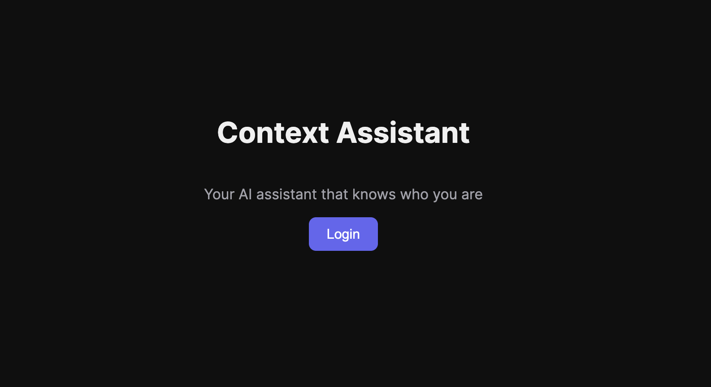
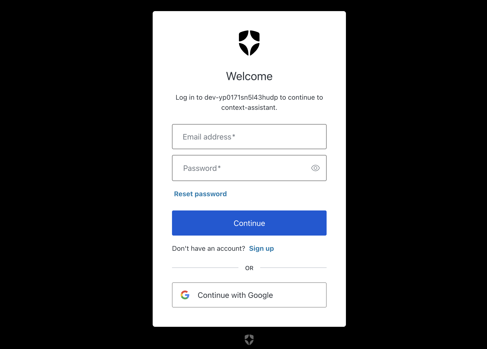
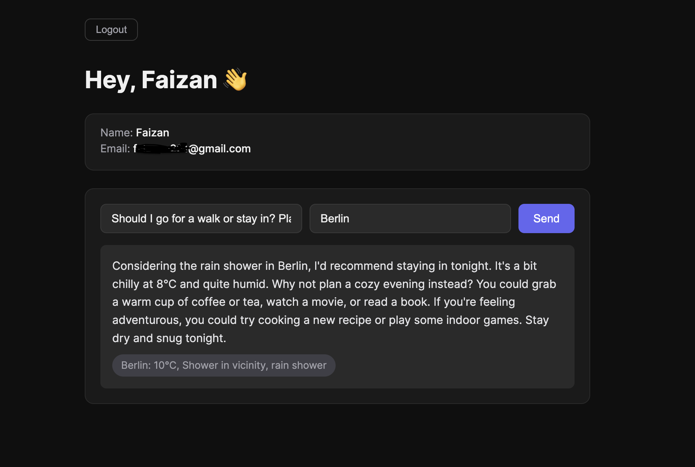

# Context Assistant 

A full stack AI personal assistant secured with Auth0 that knows who you are, fetches your profile from a protected API, and answers questions using real-time weather data. Built for MLH Global Hack Week.

<p align="center">
  
</p>

---

## How it works

When you open the app, you log in through Auth0 Universal Login. After login, the frontend grabs your Auth0 access token and sends it to the FastAPI backend on every request. The backend validates the token, pulls your profile, and if you mention a city, fetches live weather from wttr.in. All of that context goes to Groq AI which gives you a personalized response. Your identity is preserved across every single API call — that is the whole point.

<p align="center">
  
  &nbsp;&nbsp;
  
</p>

---

## Tech Stack

| Layer | Tool |
|---|---|
| Frontend | React + Vite |
| Backend | FastAPI |
| Auth | Auth0 |
| AI | Groq (llama-3.3-70b-versatile) |
| Weather | wttr.in (no API key needed) |

---

## Project Structure

```
context-assistant/
├── backend/
│   ├── src/
│   │   ├── auth.py        # Auth0 JWT validation
│   │   ├── chat.py        # Groq AI integration
│   │   └── weather.py     # wttr.in weather fetcher
│   ├── main.py            # FastAPI routes
│   └── .env.example       # copy this to .env and fill in your values
├── frontend/
│   ├── src/
│   │   ├── components/
│   │   │   ├── Chat.jsx
│   │   │   └── Profile.jsx
│   │   ├── App.jsx
│   │   └── main.jsx
│   └── .env.example       # copy this to .env and fill in your values
└── assets/                # screenshots
```

---

## Getting Started

### Prerequisites

Make sure you have these installed before starting:

- Python 3.11+
- Node.js 18+
- uv — `pip install uv`

---

### Step 1 — Auth0 Setup

This is the most important part. Read carefully and do not skip any step.

1. Go to [auth0.com](https://auth0.com) and create a free account
2. Go to **Applications > Applications** and create a new **Single Page Application**, name it `context-assistant`
3. In your app settings scroll down to **Application URIs** and add:
```
Allowed Callback URLs:  http://localhost:5173
Allowed Logout URLs:    http://localhost:5173
Allowed Web Origins:    http://localhost:5173
```
4. Hit **Save Changes** and note down your **Domain** and **Client ID** — you will need both
5. Go to **Applications > APIs** and create a new API:
```
Name:       context-assistant
Identifier: http://localhost:8000
```
6. Inside that API go to the **Application Access** tab, find your app, Client Access and hit **Grant Access**

> This step 6 is the mistake i was makin too :-)). If your login keeps failing, come back and check this first.

---

### Step 2 — Groq Setup

1. Go to [console.groq.com](https://console.groq.com) and create a free account
2. Go to **API Keys** and create a new key
3. Copy and save it — you will need it in the next step

---

### Step 3 — Backend Setup

```bash
cd backend
uv venv
source .venv/bin/activate    # on Windows: .venv\Scripts\activate
uv add fastapi uvicorn python-jose httpx python-dotenv groq
```

Now create your `.env` file. The `.env.example` is already there to show you the format — just copy it and fill in your real values:

```bash
cp .env.example .env
```

Open `.env` and fill in:

```env
AUTH0_DOMAIN=your-domain.us.auth0.com
AUTH0_AUDIENCE=http://localhost:8000
GROQ_API_KEY=your-groq-api-key
```

> Never rename `.env.example` directly to `.env`. Always copy it. The `.env` file is in `.gitignore` so your secrets never get pushed to GitHub.

Run the backend:

```bash
uvicorn main:app --reload
```

Backend runs on http://localhost:8000. You should see `Uvicorn running` in the terminal.

---

### Step 4 — Frontend Setup

Open a new terminal and do not close the backend one:

```bash
cd frontend
npm install
```

Same as backend — copy the example file and fill in your values:

```bash
cp .env.example .env
```

Open `.env` and fill in:

```env
VITE_AUTH0_DOMAIN=your-domain.us.auth0.com
VITE_AUTH0_CLIENT_ID=your-client-id
VITE_API_URL=http://localhost:8000
```

> `VITE_AUTH0_DOMAIN` and `VITE_AUTH0_CLIENT_ID` come from your Auth0 app settings page. `VITE_API_URL` stays as `http://localhost:8000` unless you deploy the backend somewhere else.

Run the frontend:

```bash
npm run dev
```

Frontend runs on http://localhost:5173

---

## Usage

1. Open http://localhost:5173
2. Click **Login** and sign in with your Auth0 account
3. Type a message in the chat box
4. Add a city name if you want weather context
5. Hit **Send** or press **Enter**
6. The AI responds using your identity and live weather data

---

## Important Notes

- Both backend and frontend must be running at the same time in separate terminals
- Backend on port **8000**, frontend on port **5173** — do not mix them up
- `.env` files are in `.gitignore` — never commit them, never share them
- `.env.example` files are safe to commit — they show the format without real values
- wttr.in needs no API key, just pass any city name in the chat
- Groq free tier gives you plenty of requests for development and testing

---

## API Endpoints

| Method | Endpoint | Description |
|---|---|---|
| GET | `/api/profile` | Returns authenticated user profile |
| POST | `/api/chat` | Sends message to Groq AI with optional weather context |

Both endpoints require a valid Auth0 Bearer token in the `Authorization` header. Without it you get a 401.

---

## Built With

- [Auth0](https://auth0.com) — Authentication
- [Groq](https://groq.com) — AI inference
- [wttr.in](https://wttr.in) — Weather API
- [FastAPI](https://fastapi.tiangolo.com) — Backend framework
- [React](https://react.dev) — Frontend framework
- [Vite](https://vitejs.dev) — Frontend build tool